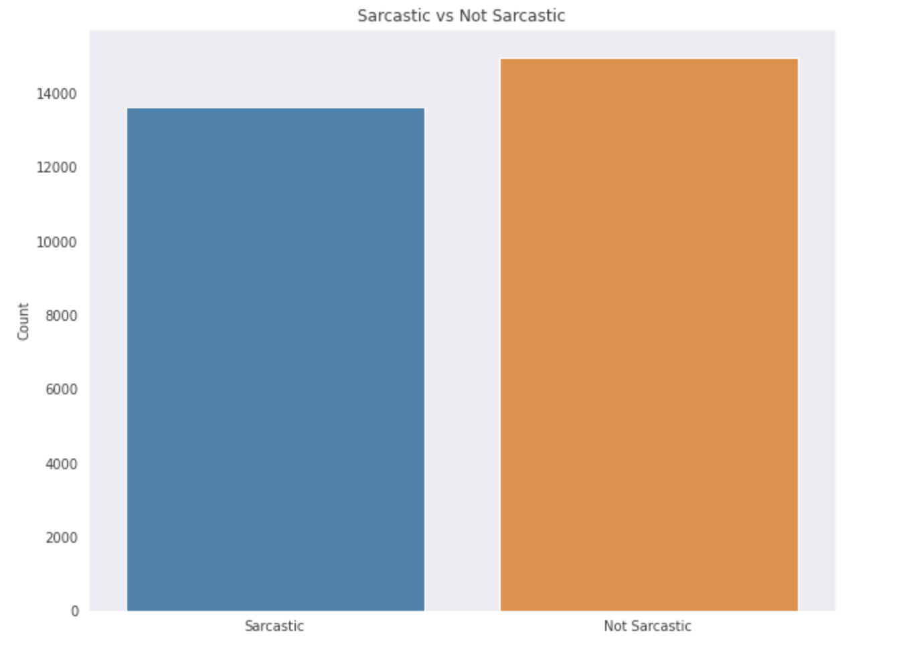

# Détection du Sarcasme

## Description

 Les données textuelles d’opinions ont connu une augmentation très remarquable, sur internet via les réseaux sociaux, commentaires et avis sur les diverses plateformes d’e-commerce, streaming Video / Audio. 

L’analyse des sentiments est utilisée pour analyser ces opinions et essayer de comprendre et d’extraire l’émotion derrière le message.

Merci de noter que le dataset est disponible sur [Kaggle](https://www.kaggle.com/rmisra/news-headlines-dataset-for-sarcasm-detection). J'en remercie les auteurs.

## Context

L’analyse des sentiments fait face à de nombreux défis, y compris la détection du Sarcasme.

Sarcasme : Une forme d’ironie, qui a pour but de tourner en dérision une situation ou une personne. Il fait appel à l’humour avec subtilité pour passer un message mal-intentionné. 

Il peut s’exprimer de manière évidente ou non, une critique indirecte ou de manière dissimulée.

## Objectif

Mettre en place un outil permettant la détection du Sarcasme dans du text en se basant sur les articles de deux journaux :

- [TheOnion](https://www.theonion.com) : Un site d’informations qui a pour vocation de produire des versions sarcastiques d’événements d’actualités ou de fiction.
- [The Huffington Post](https://www.huffpost.com) : Un site d’aggregation d’informations.

Utiliser du Deep Learning pour entrainer un modèle à partir des données des deux sites afin de classer un article et décider s’il est Sarcastique ou Non à partir de son titre. 

## Analyse du Dataset

Le dataset est constitué de trois colonnes : 

- Headline : Titre de l’article au format text.
- Article Link : Lien vers l’article.
- Sarcastic : Information boolean (Vrai/Faux) permettant de savoir si l’article comporte du sarcasme ou pas. 

#### Exemples :

- Non Sarcastique : “Eat your Veggies : 9 Deliciously Different Recipes“ ; qu’on peut traduire par “Mangez vos légumes : 9 recettes délicieusement différentes”.

- Sarcastique : “Inclement Weather Prevents Liar From Getting To Work” ; qu’on peut traduire par le menteur ne peut se rendre à son lieu de travail par jour de mauvais temps.

## Modélisation et Architecture des modèles

J'ai mis en place différentes architectures basées sur les réseaux de neurones. Je les ai évaluées avec les différentes métriques.

### Les modèles entraînés

- [Le modèle Dense](./resources/screenshot/Dense.png)
- [Le modèle RNN (Recurrent Neural Network) :  LSTMs (Long Short-Term Memory)](./resources/screenshot/LSTM.png)
